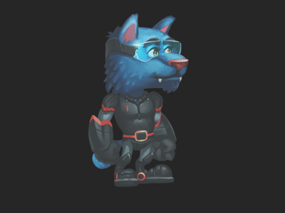

# STIP

This model was an experiment to see if using the [COA Tools](https://github.com/ndee85/coa_tools) addon in Blender could result in a decent glTF model.

Currently this model has a limitation that when using a perspective camera, any rotation at all causes clipping. This is due to the primitive sort order being determined by centroid depth.

Steps to reproduce this model in Blender:

1. Import model using COA Tools import.
2. Replace all COA Materials with Principled BSDF in the shaders for all materials in scene. 
3. Export as glTF

## Screenshot

## License Information

The original asset for this model is licened from [COA Tools](https://github.com/ndee85/coa_tools) as GPL-3.0 License. Please visit that project for more information.
